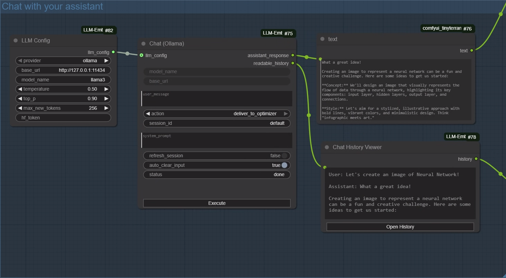

# ComfyUI-LLM-Embeder

Local LLM chat nodes for ComfyUI, with a clean handoff path to downstream prompt optimization.

## Features
- Multi-turn chat with Ollama `/api/chat`
- Optional Hugging Face Inference API support via LLM Config
- Session memory by `session_id` (in-memory only)
- Optional `system_prompt`
- Scrollable history in a modal viewer
- `deliver_to_optimizer` action outputs the latest assistant reply only
- Auto-clear input after send (toggle)

## Nodes

### Chat (Ollama)
Inputs:
- `model_name`: model id (Ollama or HF, depending on provider)
- `base_url`: Ollama base URL (ignored when provider is `huggingface`)
- `user_message`: user input text
- `action`: `send` / `regenerate` / `clear` / `deliver_to_optimizer`
- `session_id`: conversation id
- `system_prompt`: system message
- `refresh_session`: reset history for the session id
- `auto_clear_input`: clear input after a successful send
- `llm_config`: optional config from LLM Config node

Outputs:
- `assistant_response`: only non-empty when `action=deliver_to_optimizer`
- `readable_history`: full readable transcript

Behavior:
- `send`: appends user input, calls the provider, updates history
- `regenerate`: drops the last assistant turn, calls the provider again
- `clear`: resets history (keeps system prompt if set)
- `deliver_to_optimizer`: does not call the provider; returns the latest assistant reply from history

### LLM Config
Outputs a `LLM_CONFIG` struct that can be shared across Chat nodes.

Fields:
- `provider`: `ollama` or `huggingface`
- `base_url`: Ollama base URL
- `model_name`: Ollama model name or Hugging Face model id
- `temperature`
- `top_p`
- `max_new_tokens`
- `hf_token`: Hugging Face API token (recommended)

### Chat History Viewer
Shows `readable_history` and provides an "Open History" modal for full scroll.

## Hugging Face Inference API
When `provider=huggingface`, the Chat node will call:
`https://api-inference.huggingface.co/models/{model_name}`

Notes:
- Many public models still require an HF token.
- Chat history is converted into a single prompt before the API call.

## Install
1) Place this folder under `ComfyUI/custom_nodes/`
2) Restart ComfyUI
3) Add nodes:
   - `Chat (Ollama)`
   - `LLM Config`
   - `Chat History Viewer`

## Usage
1) Create `Chat (Ollama)` and set `base_url` / `model_name`
2) Set `action=send`, click Execute to chat
3) When satisfied, set `action=deliver_to_optimizer` and Execute
4) Use `assistant_response` output to feed your optimizer node

## Screenshot

Example graph: `LLM Config` drives `Chat (Ollama)` via `llm_config`, and outputs route to a `text` node plus `Chat History Viewer` for full history review.

## API
Frontend calls POST `/chat_optimize/chat` and receives:
- `assistant_response`
- `readable_history`

## Notes
- History is in memory only; refresh or restart clears it.
- `assistant_response` is empty for all actions except `deliver_to_optimizer`.
- If new fields do not appear, restart ComfyUI and re-add the node.

## Contact
For questions or collaboration, email: `kanglesun@gmail.com`.

## License
MIT. See `LICENSE`.
